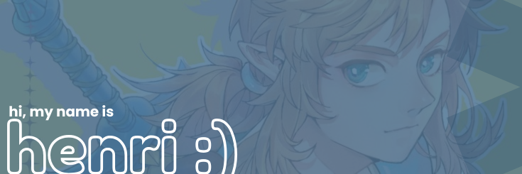

  

###

  
  
  <!-- Total Stars -->
  

  <!-- Followers -->
  

###

 

###

<h3 align="center">✨ Who am I?</h3>

###

Hi, welcome to my <strong>GitHub profile</strong>.
My name is Henrique, but you can call me Henri or Floukem, and here you will see my journey in the world of programming.
My journey in the world of programming began in 2023, when I had my first contact with the art of programming something: ``Arduino in a project created at my school``.
But it was in 2024 that my journey really began, when my school introduced the ``technical course in systems development``, in which I was able to learn and improve my skills in <strong>Python, HTML and CSS</strong>.
I graduated in December 2025, and nowadays I constantly seek to improve my programming skills, mainly in basic and slightly elaborate programs in Python and in improving my front-end skills.

###

###

<h3 align="center">👑 A little more about me</h3>

###

🔹 I enjoy being able to develop projects in groups 
🔹 Always willing to help anyone who would like to learn more about programming 
🔹 I like being around people who can contribute to my journey 
🔹 A design enthusiast with a strong sense of identity 
🔹 A big listener of Adele 
🔹 I enjoy experiencing great moments with my friends

###

<h3 align="center">🎓 Academic Training</h3>

###

<h3 align="center">💬 Contact me</h3>

###

  
  
  

###

<h3 align="center">⭐ GitHub Stats</h3>

###

 

  
  

  

###

<h3 align="center">💻 Programming Language</h3>

###

  
  
  
  
  
 
  

###

<h3 align="center">💻 Tech Stacks</h3>

###

  
  
  
  
  
  
  
  
  
  
  
  
  

###

  

###

