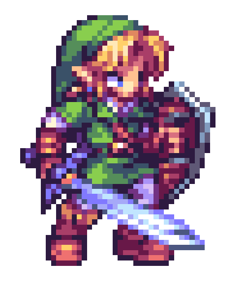

<h1 align=center>Olá, bem-vindo ao Laboratório do Floukem</h1>

  

   

---

<h3 align=center>Quem sou eu?</h3> 

Olá! Bem-vindo ao meu Laboratório (também conhecido como meu perfil do GitHub). Meu nome é Henrique, mas pode me chamar de Henri ou Floukem. 
Minha jornada no mundo da programação começou em 2023, onde tive meu primeiro contato com a programação por meio dos arduinos, na minha escola. 
Mas foi em 2024 que o mundo da programação ganhou força, quando minha escola introduziu o curso técnico em Desenvolvimento de Sistemas. Nele pude aprender e desenvolver habilidades em Python, HTML, CSS e MySQL.
Em 2026, dei um novo passo: Iniciei minha graduação em ADS na Fatec. 
Conclui meu curso em dezembro de 2025, e atualmente busco constantemente aperfeiçoar minhas habilidades, além de aprender coisas novas, principalmente em Python e nas linguagem componentes do Front-End.

---

<h3 align=center>Um pouco mais sobre mim...</h3> 

ᯓ★ Gosto de desenvolver projetos em grupo 
ᯓ★ Sempre disposto a ajudar quem quiser aprender mais sobre programação 
ᯓ★ Gosto de estar perto de pessoas que possam contribuir para a minha trajetória 
ᯓ★ Entusiasta de design com forte senso de identidade 
ᯓ★ Fã das músicas da Adele 
ᯓ★ Gosto de viver momentos marcantes com meus amigos 

---

<h3 align=center>GitHub Stats</h4>

  
  

---

<h4 align=center>Contributions Graph</h4>
  

---

<h3 align=center>Formação acadêmica</h3>

  
 &nbsp;

---

<h3 align=center>Meios de comunicação</h3>

  

---

<h3 align=center>Tech Stack</h3>

#### Linguagens de Programação
<table>
<tr>
<td align="center" width="75">

 Python
</td>
<td align="center" width="75">

 Java
</td>
<td align="center" width="75">

 C++
</td>
<td align="center" width="75">

 Markdown
</td>
</tr>
</table>

#### Desenvolvimento Front-End
<table>
<tr>
<td align="center" width="75">

 HTML5
</td>
<td align="center" width="75">

 CSS3
</td>
<td align="center" width="75">

 Bootstrap
</td>
</tr>
</table>

#### Desenvolvimento Back-end
<table>
<tr>
<td align="center" width="75">

 Python
</td>
</tr>
</table>

#### Banco de Dados & DevOps
<table>
<tr>
<td align="center" width="75">

 GitHub
</td>
<td align="center" width="75">

 Git
</td>
</tr>
</table>

---

<h3 align=center>Além do Código</h3>

<table>
<tr>
<td align="center" width="25%">
 
<b>Assistir TV</b> 
Momento de entretenimento e informação
</td>
<td align="center" width="25%">
 
<b>Animes</b> 
Assistir e descobrir novos animes
</td>
<td align="center" width="25%">
 
<b>Jogar Vídeo Game</b> 
Ninguem aqui é de ferro :)
</td>
<td align="center" width="25%">
 
<b>Estudar</b> 
Buscar saber de coisas novas
</td>
</tr>
</table>

---

  

